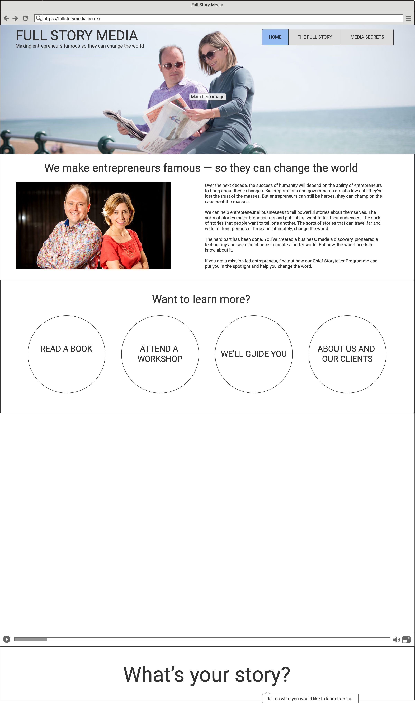
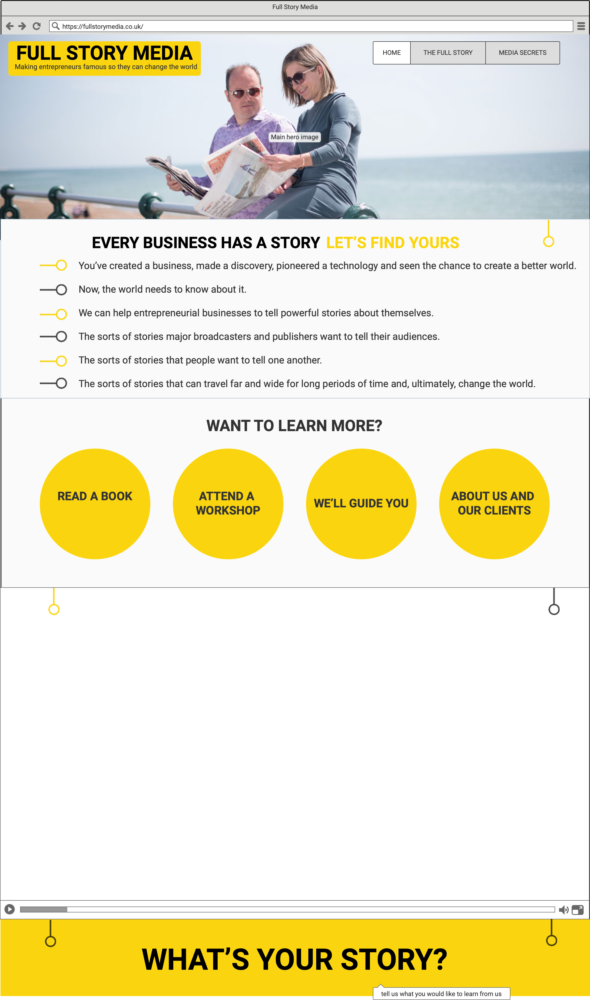

# Full Story Media web redesign 

A good journalist friend of mine, Jon Card, asked me to help "sort out" his website. And this is the approach I took for this Milestone project.

The current website is still live [here](https://fullstorymedia.co.uk/). It is built in using Wordpress as a CMS, so design and layout was largely dictated by the theme he chose.

Furthermore, there is very little thought about the overall architecture of the site. With various elements of his business bolted on to the navigation - which is in alphabetical order. 

**Jon sent me a loose brief:**

1. Present a modern and exciting shop window for our services with better design and layout including embedded videos and display photography

2. Enable data capture, sign-ups and make finding lead magnets easier

3. Become a base to advertise and launch products (webinars, services, book etc)

4. Boost JC's personal brand and profile

## Wireframing

My wireframe was sketched out and then designed to address the site architecture. 

Six pages were reduced to three with a cleaner layout which makes more of media assets which also help enhance Jon's personal brand and profile. 

The home page become more of a landing page with several options to go to About (The Full Story) and Products (Media Secrets).

There are also more opportunity to explore at various points, not only to allow the user more control but also, in future, there can be more data capture about usage. 

The sign-up form which is at the bottom of Home and The Full Story and at the top of Media Secrets is also data capture but also is aimed to help Jon learn more about his audience and what services they want. 

My wireframe designs can be [downloaded from here](https://www.dropbox.com/t/8jiDT62lFdhVZFFg) for the next 7 days. 

## Set-backs 

I struggled with the initial design of the site (see initial wireframes) but took inspiration from the [case studies PDF](https://fullstorymedia.co.uk/wp-content/uploads/2020/04/Chief-Storytellers-2020.pdf) that a designer has created. I'm particularly pleased with the spotlight css which is in-keeping with this.

This was my first project designed using the Bootstrap4 framework and took a lot of time getting to grips with it, and also making sure I was using CMD, Gitpod and Github properly.

My mentor also confirmed that I probably wasted too much time fleshing out the design of the wireframe. 

As a result some things were not in scope for this project. Including:

 - The spokes which nicely break up the page and encourage scrolling
 - "Spotlight" breaks for mobile
 - An extra sign-up form landing page

## Next steps

It is my intention for this site to replace the current FSM website. One possible sticking point is that Jon believes that the blogs that have been written should stay. 

So I will probably install a better more modular bootstrap based theme and build the blog pages in-sympathy with what has created here. Or build these three pages in a Wordpress framework. 
