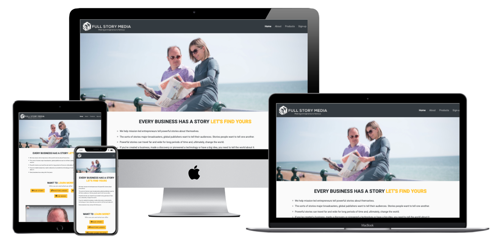
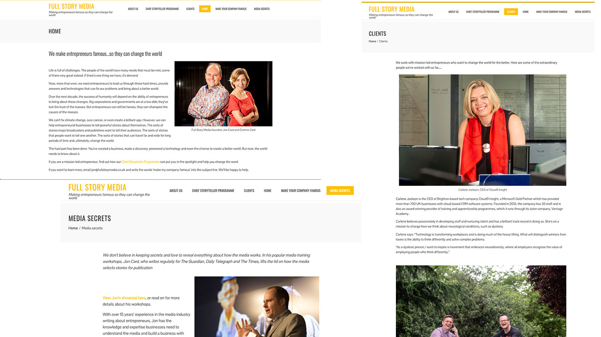

 Full Story Media rebuild
========================

Versions
========

This website is a re-architecture and rebuild of Full Story Media (FSM) website. Version 1 (v1) was built for Code Institute Frontend Developer Milestone Project 1 (M1). It was built within a constrained timeframe and didn’t meet the criteria for the project.

[Version 2](https://fullstorymedia.co.uk/) (v2) was rebuilt within a Wordpress framework for the client, informed by the architecture of the v1 but with stakeholders consulted on the layout and bugs known to be within v1 squashed. The project was built in Wordpress because the client already had a significant amount of ongoing article content which had been SEO’d but needed a design overhaul. I deployed the Uncode theme to replicate v1’s layout and the Bootstrap grid structure which works with the same principles of the Bootstrap framework. In v2 an Uncode template for the article layout and blog homepage were used.

[Version 3](https://dandavies23.github.io/full-story-media/) is a significant rebuild of v1 with the intention of matching the MVP requirements of the Milestone as well as implementing a satisfactory project management framework, incorporating the elements of v2 with additional bug fixes and updates. V2 will continue to be upgraded when the client has further budget and more ideas of what else is on the roadmap for v2 at the end of this readme.

 

Background
==========

FSM is a small start-up by two former journalists who are helping entrepreneurs gain exposure in mainstream news by passing on tips of what journalists are looking for. The website was first built by Jon Card using Wordpress and a simple theme. Here are some screen grabs from the original website.

 
 
The website is perhaps typical for a journalist who is paid per word! Many pages can be viewed as a slightly prettier word document. Furthermore, as the company has grown and offered more services additional pages have been added to the navigation - which is in alphabetical order rather than designed. There is very little thought about the overall architecture of the site and various pages have been added as the business has grown. The navigation is in alphabetical order.
 

Stakeholders' aims
==================

1.  "Present a modern and exciting shop window for our services with better design and layout including embedded videos and display photography

2.  "Enable data capture, sign-ups and make finding lead magnets easier

3.  "Become a base to advertise and launch products (webinars, services, book etc)

4.  "Boost JC's personal brand and profile"

 

User goals
==========

Full Story Media is a new business, the main user aim is to find out more about the business the sign-up for one of its products. 

The demographic of successful conversions fall into the following users: 

1.  They are a third-party researching on behalf of a key stakeholder 

2.  They are an entrepreneur or business owner of a fledgling SME

3.  They work for a company’s press department or for a PR company

 

Very little is known about the actual users of the website. The stakeholders mentioned, a priority of the new site is to enable data capture. In these early iterations of the site this is why there it encourages users to share details via a reasonably persistent sign-up modal and separate page. It was decided with discussions with stakeholders that the 3rd user group wasn’t to be targeted as the companies main money earner is in a managed 1-2-1 service (Chief Storytellers).

 

In early discussions this was also why it was also decided not to have a single scrolling page website. More could be tracked by users clicks and, further down the line, usage would be used to inform the next site structure and business objective. This was the intention of the menu navigation and also the “splash navigation” in the early wireframes. To leave a click-trail of usage. 

 

It’s fair to say that the first design was considered to be more “playful” than this version but this has changed for reasons of clarity and to appeal to the 1st user group.When working on v2 stakeholders raised concerns that the navigation wasn’t conventional and that user 1 might get lost or irritated.

For v3 the intended audience is essentially B2B. Although the site shouldn’t be seen as entirely corporate or formal it does intend to be reassuring in tone to reassure user 1. User 2 is a decision maker but time starved which is why the splash menu gets them to the products and services quickly. 

 

 

User Experience
===============

Home page
---------

The intention was to get information across as concisely as possible. Lines were taken from the original FSM manifesto previously on the front page of the old site, the intention was to kept the spirit of the initial pitch but for the user to be able to gather a quicker understanding of the company’s aims. 

The 'Learn More' buttons are intended to make the user active. They take the user largely to a service or product on the products page. Its intention is to get the user straight to the products if they know enough about the company.

If the user still needs reassurance, underneath this is a nicely presented video which was previously buried on YouTube. And below this are case studies, originally this was another sign up but I decided to a B2B customer (who didn’t want to play!) would want something a bit more tangible and printable. The case studies are very credible, some elements of their were used in the website design. 

 

About
-----

Emphasis was placed on expertise and experience, whilst the the "about us” section is also naturally friendlier. This section is for primarily for user 1 who wants to know the people behind FSM and its standing before the make a business decision. This is why it is second in the navigation. The original site client section was added as a testimonial (reason to buy) rather than a biography about the people who FSM have been helped. The page finishes with a modal version of the sign-up form adding another opportunity to find out more and tell FSM how they would like to learn. 

 

Products
--------

The splash navigation that is featured on the home page is echoed here. Once again to get user 2 to the products and services. We lead with the premium package: the hands-on support followed by the book. Then finally the Media Masterclasses.

 

Sign-up
-------

This final page is again to collect anyone else who wants to hear more at the end of the journey. Again, there’s an opportunity to tell their business story which echoes the first page.

 

Testing User Stories
====================

First Time Visitor Goals
------------------------

1.  As a First Time Visitor (user 1), I want to understand the main purpose of the business and how the company can help my client’s business.

    -   On visiting the site  the logo and strap-line.

    -   The navigation is clear and follows clear labelling conventions

    -   The pitch concisely names the intent

    -   The call to actions button demonstrate the available products

    -   The video is clear and credible.

    -   Case studies can be printed and taken to the boss. 

    -   The about page has further info of the professional drive of the company stakeholders and testimonials from happy clients.

2.  As a First Time Visitor (user 2), I want to get to the information that I need quickly and clearly. 

    -   If the user is time strapped they will read the headers - “this website is for me” “I do want to learn more”. The CTA then leads largely to the products page.

    -   The products page has the highest priority (and most relevant to user 2) information first. The hero image also features Jon interviewing renowned British entrepreneur Mary Portas. 

    -   The case studies are available from Chief Storytellers for user 1, direct link to the book then another opportunity to sign up at the bottom. This prefils the masterclass because this is where the CTA is focussed. In later versions this may be replaced with a calendar. 

3.  As a First Time Visitor (user 1 or user 2), I want to understand more about the people behind the business. 

    -   The two primary stakeholders are first presented on the page. Every hero image features Jon Card spreading the word or interviewing business leaders.

    -   Our Story is given highest priority in the Learn More CTA, About is also the next item in the main navigation. 

    -   The are links out to the main stakeholders in the About Us section, the “Want More” section in the footer links to social channels and offers another opportunity to staying in touch by signing up. 

4.  As required by the stakeholders, the site is a ’shop front' for its offerings in this version the assumption is the Returning User will have made a decision. User 2 may have printed out the case studies, or will send the About and Products pages to senior stakeholders. 

5.  Frequent visitors are not in scope for this project but this will focus on the blog and current updates and activity which is only just starting to re-open. As v2 is developed stakeholders will use the [news section](https://fullstorymedia.co.uk/news/) of their website more effectively. 

 

Design
======

The “spotlight” yellow was an idea which I drew from the case studies. Although in the final web design it was darkened for readability. A secondary colour was added using the [Coolors](https://coolors.co/) from the palate a lighter blue was chosen as I didn’t want hyperlinks to appear too old fashioned. 

 

Workflow
========

In further stakeholder discussion a todo list was created in [Todoist](https://todoist.com/app/project/2263066235). In v3 I used the [Project section](https://github.com/dandavies23/full-story-media/projects/1) of Github based on the Kanban Methodology. This was used to make adjustments in reference to the last submission feedback. It also allowed me to keep on top of bugs.

 

Testing
=======

The site was tested on Safari, Chrome and Opera browsers. I used the Chrome Inspection tool to check the layout. I also tested this at different screen size and using different mobile phone emulators in the tool. Frequent descriptive commits were made to keep on track of changes. These were then pushed through to Github.

 

Issues and Resolutions
======================

I picked up all the bugs which were fixed for v2 and recreated them in v3. I resized images to make the site faster and re-organised the image folders to make it readable. The 5MG PDF was left on the Wordpress hosting to not impair performance and take up space in Github or Gitpod repositories and make cloning/forking easier. 

I spent a lot of time making the Bootstrap grid work properly and fixing the buttons. I am grateful for the advice and support I got from this on Slack and Stack Overflow. 

Full details of all the steps taken and any outstanding bugs in the [Github project space](https://github.com/dandavies23/full-story-media/projects/1). 

 

Deployment
==========================================================================================

To deploy this page to GitHub Pages from its [GitHub repository](https://github.com/dandavies23/full-story-media), the following steps were taken:

1.  From the menu items near the top of the page, select **Settings**.

2.  Scroll down to the **GitHub Pages** section.

3.  Under **Source** click the drop-down menu labelled **None** and select **Master Branch**

4.  On selecting Master Branch, the page is automatically refreshed, the website is now deployed.

5.  Scroll back down to the **GitHub Pages** section to retrieve the link to the deployed website.

 
How to run this project locally

To clone this project from GitHub:

1.  Under the repository name, click "Clone or download".

2.  In the Clone with HTTPs section, copy the clone URL for the repository.

3.  In your local IDE open Git Bash.

4.  Change the current working directory to the location where you want the cloned directory to be made.

5.  Type `git clone`, and then paste the URL you copied in Step 3.

~~~~~~~~~~~~~~~~~~~~~~~~~~~~~~~~~~~~~~~~~~~~~~~~~~~~~~~~~~~~~~~~~~~~~~~~~~~~~~~~
git clone https://github.com/dandavies23/full-story-media
~~~~~~~~~~~~~~~~~~~~~~~~~~~~~~~~~~~~~~~~~~~~~~~~~~~~~~~~~~~~~~~~~~~~~~~~~~~~~~~~

1.  Press Enter. Your local clone will be created.

Further reading and troubleshooting on cloning a repository from GitHub [here](https://help.github.com/en/articles/cloning-a-repository).

-----------------------------------------------------------------------------

Technologies and Credits
========================

V1 and V3 were designed on the [Bootstrap framework](https://getbootstrap.com/) and [Wordpress theme Uncode](https://undsgn.com/uncode/) was used to emulate what I’d learned from the grid layout. I used Gitpod on the Code Institute template, and particularly used Emmet and Beautify. I used 

[Coolors](https://coolors.co/) was used to pair site colours. Images were exported for web from Photoshop and further compressed using [TinyPNG](https://tinypng.com/)

 

Acknowledgements
================

I’m really grateful for help on Stack Overflow, W3Schools, Code Institute’s Slack channel and other CI people who have additionally helped me including Maggie Walsh, tutor support from Tom Traas and my mentor Akshat Garg. Also thanks to friends and family, including Juliet Spare, Jon Kennard and James Eldred and, ofcourse, the enthusiasm and support from Jon and Corrine Card from Full Story Media.

This project is for educational use only, it was created for Code Institute Module of User Centric Frontend Development.
